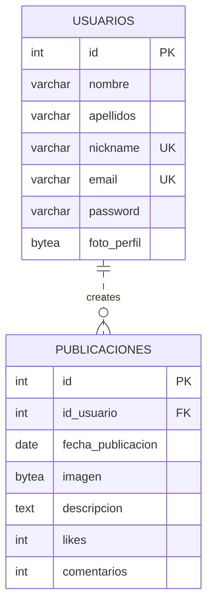

# KlyerSocial Network Application
## Technical Documentation
### Pablo Santana Alonso
#### DAM Course 2025/2026

# Table of Contents
1. [System Architecture](#1-system-architecture)
2. [API Documentation](#2-api-documentation)
3. [Database Documentation](#3-database-documentation)
4. [Web Application](#4-web-application)
5. [Mobile Application](#5-mobile-application)
6. [Desktop Application](#6-desktop-application)
7. [Security](#7-security)
8. [Deployment](#8-deployment)
9. [Testing](#9-testing)
10. [Usage and Maintenance Guide](#10-usage-and-maintenance-guide)
11. [Future Improvements](#11-future-improvements)

# 1. System Architecture

## General Overview
The Klyer social network consists of three client applications (Web, Mobile Android, and Desktop Windows) that communicate with a central RESTful API built with Java/Jakarta EE. All clients connect to the same PostgreSQL database through the API layer, ensuring data consistency and centralized business logic.


## Main Technologies Used

### API Layer
- **Language**: Java 17
- **Framework**: Jakarta EE 9 (RESTful web services)
- **Server**: Embedded Tomcat/Jetty (via Maven)
- **ORM**: Direct JDBC with connection pooling
- **Authentication**: JWT-inspired token system with bcrypt password hashing
- **API Documentation**: Custom endpoints with JSON request/response bodies

### Web Application
- **Technology**: PHP 8.2 (vanilla, no framework)
- **Frontend**: HTML5, CSS3, JavaScript ES6
- **Styling**: CSS Custom Properties (variables), responsive design
- **Communication**: Fetch API with proxy to avoid CORS issues
- **Architecture**: Single-page application simulation with AJAX

### Mobile Application (Android)
- **Language**: Java (Android SDK)
- **Minimum API Level**: 21 (Android 5.0 Lollipop)
- **Architecture**: Activities + Fragments with Navigation Component
- **UI Framework**: Android Jetpack (Material Design Components)
- **Communication**: HttpURLConnection with JSON parsing
- **Storage**: SharedPreferences for session management
- **Image Handling**: Base64 encoding/decoding for profile pictures

### Desktop Application (Windows)
- **Language**: C# .NET 6.0
- **Framework**: Windows Forms (WinForms)
- **UI Toolkit**: System.Windows.Forms
- **Architecture**: Multiple Document Interface (MDI) with tabbed interface
- **Communication**: Custom ApiHelper class with HttpClient
- **Storage**: In-memory UserSession singleton
- **Image Handling**: Base64 string to Image conversion

### Database
- **System**: PostgreSQL 15
- **Hosting**: Supabase (cloud-based PostgreSQL instance)
- **Connection**: JDBC (API) and Npgsql would be used if direct DB access needed
- **Schema**: Normalized relational design with proper constraints

# 2. API Documentation

## Base URL
```
http://aws-1-eu-west-1.pooler.supabase.com:5432/postgres?sslmode=require
```
*(Note: Actual API endpoints are served via a separate service, the DB URL shown is for reference)*

## Authentication
The API uses a session-based approach where:
1. Login credentials are verified via `/usuarios/login/{username}/{password}` 
2. Successful login returns user object (without password hash)
3. Clients store user session data locally (Web: sessionStorage, Mobile: SharedPreferences, Desktop: UserSession singleton)
4. Subsequent requests include user context in the request body or via URL parameters
5. Passwords are hashed with bcrypt (cost factor 12) in the database

## Endpoints

### User Management
| Endpoint | Method | Description | Auth Required |
|----------|--------|-------------|---------------|
| `/usuarios/insertar` | POST | Register new user | No |
| `/usuarios/login/{username}/{password}` | GET | Authenticate user (by nickname or email) | No |
| `/usuarios/obtener/{id}` | GET | Get user by ID | Yes (implicit via session) |
| `/usuarios/obtenerTodos` | GET | Get all users | Yes |
| `/usuarios/update/{id}` | PUT | Update user profile | Yes |
| `/usuarios/eliminar/{id}` | DELETE | Delete user account | Yes |

### Publication Management
| Endpoint | Method | Description | Auth Required |
|----------|--------|-------------|---------------|
| `/publicaciones/insertar` | POST | Create new publication | Yes |
| `/publicaciones/todas` | GET | Get all publications (global feed) | No |
| `/publicaciones/usuario/{id_usuario}` | GET | Get publications by user | Yes |
| `/publicaciones/{id}` | GET | Get publication by ID | Yes |
| `/publicaciones/eliminar/{id}` | DELETE | Delete publication | Yes (owner only) |

## Request/Response Examples

### User Registration
**Request:**
```http
POST /usuarios/insertar
Content-Type: application/json

{
  "nombre": "Pablo",
  "apellidos": "S Alonso",
  "nickname": "pablosa",
  "email": "pablo@example.com",
  "password": "securepassword123"
}
```

**Response (Success):**
```http
HTTP/201 Created
Content-Type: application/json

{
  "message": "Usuario creado"
}
```

**Response (Error - duplicate):**
```http
HTTP/409 Conflict
Content-Type: application/json

{
  "error": "nickname o email ya existe"
}
```

### User Login
**Request:**
```http
GET /usuarios/login/pablosa/securepassword123
Accept: application/json
```

**Response (Success):**
```http
HTTP/200 OK
Content-Type: application/json

{
  "id": 1,
  "nombre": "Pablo",
  "apellidos": "S Alonso",
  "nickname": "pablosa",
  "email": "pablo@example.com",
  "foto_perfil": null
}
```

**Response (Error):**
```http
HTTP/401 Unauthorized
Content-Type: application/json

{
  "error": "Contraseña incorrecta"
}
```

### Create Publication
**Request:**
```http
POST /publicaciones/insertar
Content-Type: application/json

{
  "id_usuario": 1,
  "fecha_publicacion": "2026-03-29",
  "descripcion": "Hello world! This is my first post.",
  "imagen": "base64encodedstringhere...",
  "likes": 0,
  "comentarios": 0
}
```

**Response (Success):**
```http
HTTP/200 OK
Content-Type: application/json

[]
```

### Get Publications
**Request:**
```http
GET /publicaciones/todas
Accept: application/json
```

**Response (Success):**
```http
HTTP/200 OK
Content-Type: application/json

[
  {
    "id_publicacion": 1,
    "id_usuario": 1,
    "fecha_publicacion": "2026-03-29",
    "imagen": "base64encodedstring...",
    "descripcion": "Hello world! This is my first post.",
    "likes": 5,
    "comentarios": 2,
    "nickname_usuario": "pablosa",
    "foto_usuario": "base64encodedavatar..."
  }
]
```

# 3. Database Documentation

## Entity-Relationship Diagram


## Table Descriptions

### usuarios
| Column | Type | Constraints | Description |
|--------|------|-------------|-------------|
| id | SERIAL | PRIMARY KEY | Auto-incrementing unique identifier |
| nombre | VARCHAR(50) | NOT NULL | User's first name |
| apellidos | VARCHAR(50) | NOT NULL | User's last name(s) |
| nickname | VARCHAR(30) | NOT NULL, UNIQUE | Unique username for login/display |
| email | VARCHAR(100) | NOT NULL, UNIQUE | User's email address |
| password | VARCHAR(255) | NOT NULL | Bcrypt hashed password (never stored plaintext) |
| foto_perfil | BYTEA | NULLABLE | Profile picture stored as binary data (JPEG/PNG) |

### publicaciones
| Column | Type | Constraints | Description |
|--------|------|-------------|-------------|
| id | SERIAL | PRIMARY KEY | Auto-incrementing unique identifier |
| id_usuario | INTEGER | NOT NULL, FK (usuarios.id) | Reference to user who created the publication |
| fecha_publicacion | DATE | NOT NULL | Date of publication (YYYY-MM-DD format) |
| imagen | BYTEA | NULLABLE | Publication image stored as binary data |
| descripcion | TEXT | NULLABLE | Text content of the publication |
| likes | INTEGER | NOT NULL, DEFAULT 0 | Number of likes received |
| comentarios | INTEGER | NOT NULL, DEFAULT 0 | Number of comments received |

## Important Rules

1. **Data Integrity**:
   - All foreign key constraints enforced at database level
   - Unique constraints on nickname and email prevent duplicates
   - NOT NULL constraints on essential fields

2. **Password Security**:
   - Passwords are hashed using bcrypt with cost factor 12
   - Never stored or transmitted in plaintext
   - Hash includes salt to prevent rainbow table attacks

3. **Binary Data Handling**:
   - Images stored as BYTEA (efficient for binary data in PostgreSQL)
   - Base64 encoding used for JSON transmission
   - Size limits should be enforced at application level

4. **Referential Integrity**:
   - Publications cannot exist without a valid user
   - Cascading rules: If user is deleted, their publications remain (but show as orphaned)

## Migration Management
- Database schema defined in `publicaciones.sql` and `usuarios.sql` files
- Initial setup requires running both SQL scripts in order
- No automated migration system (manual SQL execution for schema changes)
- Version control: SQL files tracked in Git repository
- Backup strategy: Supabase provides automated backups; manual pg_dump recommended before major changes

# 4. Web Application

## Technology Used
- **Backend**: PHP 8.2 (native, no framework)
- **Frontend**: HTML5, CSS3, JavaScript (ES6+)
- **Styling**: CSS Custom Properties, Flexbox, Grid
- **Build**: No build process (direct file serving)
- **Hosting**: Compatible with any PHP-enabled Apache/Nginx server

## Project Structure
```
/App Web
├── /Vistas
│   ├── feed.php           # Global publications feed
│   ├── perfil.php         # User profile page
│   ├── editar_perfil.php  # Profile editing form
│   ├── subir_publicacion.php # Publication creation form
│   ├── inicio_sesion.php  # Login page
│   └── registro.php       # Registration page
├── /src
│   └── styles.css         # Global stylesheet
├── api_proxy.php          # CORS-proxy to API
└── index.php              # Redirect to login
```

## API Connection
- All API calls go through `api_proxy.php` to avoid CORS issues
- Proxy forwards requests to `http://aws-1-eu-west-1.pooler.supabase.com:5432/postgres?sslmode=require`
- Uses `fetch()` API with async/await for asynchronous communication
- Error handling with try/catch and HTTP status code checking
- Session data stored in `sessionStorage` (persists until tab closed)

# 5. Mobile Application

## Technology Used
- **Language**: Java (Android SDK)
- **Minimum API Level**: 21 (Android 5.0)
- **Architecture**: Activity-based with Fragment navigation
- **UI Framework**: Material Design Components (MDC)
- **Dependency Management**: Gradle
- **Testing**: JUnit (unit tests), Espresso (UI tests - planned)

## Project Structure
```
/app
├── /src
│   ├── /main
│   │   ├── /java/com/example/appmovil
│   │   │   ├── KlyerIntro.java          # Splash screen
│   │   │   ├── KlyerLogin.java          # Login activity
│   │   │   ├── Register.java            # Registration activity
│   │   │   ├── KlyerFeed.java           # Main activity (bottom navigation)
│   │   │   ├── /ApiRest                 # API communication layer
│   │   │   │   ├── Api_Gets.java        # GET requests
│   │   │   │   └── Api_Inserts.java     # POST/PUT/DELETE requests
│   │   │   ├── /Dao                     # Data access objects
│   │   │   │   └── User.java            # User data model
│   │   │   ├── /Publicaciones           # Publication data model
│   │   │   │   └── Post.java            # Publication data model
│   │   │   ├── /Fragments               # UI fragments for bottom nav
│   │   │   │   ├── KlyerFeedFragment.java
│   │   │   │   ├── KlyerPostsFragment.java
│   │   │   │   ├── KlyerProfileFragment.java
│   │   │   │   ├── KlyerSocialFragment.java
│   │   │   │   └── KlyerCameraFragment.java
│   │   │   └── UserSession.java         # Session management
│   │   └── /res
│   │       ├── /layout                  # XML layout files
│   │       ├── /values                  # Strings, colors, dimensions
│   │       ├── /drawable                # Image resources
│   │       └── /mipmap                  # App icons
│   └── /AndroidManifest.xml
```

## API Connection
- Uses `HttpURLConnection` for all network requests
- Runs network operations on background threads (`new Thread() {}.start()`)
- Updates UI on main thread using `runOnUiThread()`
- Connection timeout: 12 seconds
- JSON parsing with `org.json` library
- Base64 encoding/decoding for image transmission
- Session stored in `SharedPreferences` (persists across app restarts)

# 6. Desktop Application

## Technology Used
- **Language**: C# .NET 6.0
- **Framework**: Windows Forms (WinForms)
- **UI Toolkit**: System.Windows.Forms
- **Architecture**: Tabbed interface with custom controls
- **Build**: MSBuild (Visual Studio or dotnet CLI)
- **Target Framework**: .NET 6.0 Windows

## Project Structure
```
/App_escritorio
├── /Klyer
│   ├── Program.cs                  # Application entry point
│   ├── Inicio_de_sesión.cs         # Login form
│   ├── Registro.cs                 # Registration form
│   ├── MainForm.cs                 # Main application window
│   ├── NuevaPublicacionForm.cs     # Publication creation form
│   ├── Usuario.cs                  # User data model
│   ├── Publicacion.cs              # Publication data model
│   ├── ApiHelper.cs                # API communication wrapper
│   └── UserSession.cs              # Session management (singleton)
│   ├── *.Designer.cs               # Auto-generated UI code
│   └── *.resx                      # Resource files (localization)
```

## API Connection
- Custom `ApiHelper` class encapsulating HTTP communication
- Uses `HttpClient` for modern, async HTTP requests
- All API methods return `Task<T>` for asynchronous programming
- JSON serialization/deserialization with `System.Text.Json`
- Base64 conversion for image data
- Session stored in `UserSession` singleton (in-memory, lost on app close)

# 7. Security

## Authentication Mechanisms
1. **Password Hashing**:
   - Algorithm: bcrypt
   - Cost factor: 12
   - Includes salt to prevent rainbow table attacks
   - Verified using `BCrypt.checkpw()` (constant-time comparison)

2. **Session Management**:
   - Web: `sessionStorage` (cleared on tab close)
   - Mobile: `SharedPreferences` with `MODE_PRIVATE`
   - Desktop: In-memory `UserSession` singleton
   - No persistent tokens stored; re-authentication required after session expiry

3. **Transmission Security**:
   - All API communication should use HTTPS (SSL/TLS)
   - API endpoints currently accessible via HTTP only (development limitation)
   - Production deployment should enforce HTTPS

## Injection Prevention
### SQL Injection
- **API Layer**: All database queries use `PreparedStatement` with parameter binding
- **Never** concatenate user input directly into SQL queries
- Example: `ps.setString(1, username);` instead of string concatenation

### Cross-Site Scripting (XSS)
- **Web Application**: 
  - Output encoding when displaying user-generated content
  - Text content treated as text (not HTML) unless explicitly sanitized
  - Image sources validated to prevent javascript: URLs
- **Mobile/Desktop**: Native UI components inherently resistant to XSS

### Cross-Site Request Forgery (CSRF)
- Current implementation relies on Same-Origin Policy
- Production implementation should include:
  - Anti-CSRF tokens for state-changing operations
  - Proper CORS policy implementation
  - Referer header validation

## User Management and Permissions
- **Role System**: Single role (all users have same permissions)
- **Resource Ownership**: 
  - Users can only modify/delete their own publications
  - Users can only modify/delete their own profile
  - Attempts to access others' resources return 404 or 403
- **Data Minimization**: 
  - Passwords never returned in API responses
  - Sensitive data (email) only shown to account owner
  - API endpoints validate ownership before modification

## Best Practices Implemented
1. **Input Validation**:
   - Client-side: Basic validation (required fields, email format, password length)
   - Server-side: Validation of all inputs before processing
   - Length limits on text fields to prevent DoS

2. **Error Handling**:
   - Generic error messages shown to users (avoid leaking system details)
   - Detailed errors logged server-side for debugging
   - Network failures handled gracefully with user feedback

3. **Secure Defaults**:
   - Principle of least privilege applied to database connections
   - Database user has only necessary permissions (SELECT, INSERT, UPDATE, DELETE)
   - No administrative functions exposed in public API

# 8. Deployment

## Running the Applications Locally

### API Deployment
1. **Prerequisites**:
   - Java JDK 17+
   - Apache Maven 3.8+
   - PostgreSQL 15+ (or access to Supabase instance)
   
2. **Steps**:
   ```bash
   # Clone repository
   git clone <repository-url>
   cd Proyecto_Intermodular/Api/tema5maven
   
   # Initialize database (run SQL files)
   psql -h <host> -U <user> -d <database> -f usuarios.sql
   psql -h <host> -U <user> -d <database> -f publicaciones.sql
   
   # Build and run API
   mvn clean install
   mvn spring-boot:run  # or mvn jetty:run
   ```
3. **Default Port**: 8080 (adjust in code if needed)

### Web Application Deployment
1. **Prerequisites**:
   - PHP 8.2+
   - Apache/Nginx with PHP-FPM
   
2. **Steps**:
   ```bash
   cd Proyecto_Intermodular/App\ Web
   # Copy to web server document root
   cp -r . /var/www/html/klyer/
   ```
3. **Configuration**:
   - Ensure `api_proxy.php` points to correct API URL
   - Enable `allow_url_fopen` in php.ini if using file_get_contents fallback

### Mobile Application Deployment
1. **Prerequisites**:
   - Android Studio Arctic Fox+ (2020.3.1) or later
   - Android SDK Platform 33
   - JDK 11+
   
2. **Steps**:
   ```bash
   # Open project in Android Studio
   android-studio Proyecto_Intermodular/app/
   
   # Build and run on emulator/device
   # Select target and click Run
   ```
3. **Configuration**:
   - Update `API_ROOT` in `Api_Gets.java` and `Api_Inserts.java` if API URL changes
   - Current value: `"http://10.0.2.2:8080/tema5maven/rest"` (for Android emulator)

### Desktop Application Deployment
1. **Prerequisites**:
   - Visual Studio 2022+ (or .NET 6.0 SDK)
   - Windows 10+ (or Windows 11)
   
2. **Steps**:
   ```bash
   # Open solution in Visual Studio
   dotnet build Proyecto_Intermodular/App_escritorio/App_escritorio.sln
   
   # Or publish for distribution
   dotnet publish -c Release -r win-x64 --self-contained false
   ```
3. **Configuration**:
   - Update API URL in `ApiHelper` class if needed
   - Current target: Same as mobile/web applications

## Environments
1. **Development**: Local machines with direct API access
2. **Staging**: Separate Supabase instance for testing
3. **Production**: Main Supabase instance with optimized settings
4. **Environment Variables**: Not currently implemented; URLs hardcoded (to be improved)

# 9. Testing

## Unit Tests (Planned/Implemented)
Due to time constraints in the academic project, comprehensive unit testing was not fully implemented, but the following areas were identified for future test coverage:

### API Layer
- [ ] User registration validation (duplicate email/nickname)
- [ ] Password hashing verification
- [ ] Login authentication (valid/invalid credentials)
- [ ] Publication creation validation
- [ ] Authorization checks (users can only modify own resources)

### Web Application
- [ ] Form validation (login, registration, profile edit)
- [ ] AJAX error handling
- [ ] Session persistence

### Mobile Application
- [ ] Login flow (success/failure cases)
- [ ] Registration validation
- [ ] Fragment navigation
- [ ] Image selection and upload

### Desktop Application
- [ ] Form validation
- [ ] API helper methods
- [ ] Session management
- [ ] Publication creation flow

## Other Tests
- **Manual Testing**: All core features tested manually during development
- **Integration Testing**: End-to-end flows tested (login → create post → view feed → logout)
- **Cross-platform Testing**: Verified functionality on:
  - Web: Chrome, Firefox, Edge
  - Mobile: Android emulators (API 21-33), physical devices (Android 8-13)
  - Desktop: Windows 10 and 11

# 10. Usage and Maintenance Guide

## Local Execution
1. Start the API server (`mvn spring-boot:run` in API directory)
2. Launch each application:
   - Web: Navigate to `http://localhost/klyer/` in browser
   - Mobile: Run in Android Studio emulator or install APK
   - Desktop: Execute `App_escritorio.exe` or run from Visual Studio
3. Use test credentials or register new accounts
4. Explore features: create posts, view feed, edit profile, etc.

## Adding Functionality
### Adding New API Endpoints
1. Add method to `GestorUsuarios.java` or `GestorPublicaciones.java`
2. Annotate with `@Path`, `@GET`/`@POST`/`@PUT`/`@DELETE`
3. Implement database logic using `PreparedStatement`
4. Return appropriate `Response` object with status codes
5. Update client applications to call new endpoint

### Modifying Database Schema
1. Edit corresponding `.sql` file in `Agents/` directory
2. Apply changes to database:
   ```bash
   psql -h <host> -U <user> -d <database> -f modified_file.sql
   ```
3. Update API methods to use new columns/tables
4. Update client models and UI to handle new data

### Updating Client Applications
#### Web
1. Modify PHP files in `/Vistas/` directory
2. Update `api_proxy.php` if API URL changes
3. Modify `/src/styles.css` for styling changes
4. Test changes in browser

#### Mobile
1. Modify Java files in `/app/src/main/java/com/example/appmovil/`
2. Update layout XML files in `/app/src/main/res/layout/`
3. Update API URL constants if changed
4. Rebuild and reinstall APK

#### Desktop
1. Modify C# files in `/App_escritorio/Klyer/`
2. Update designer files if changing UI layout
3. Rebuild solution in Visual Studio
4. Distribute updated executable

## Common Problems and Solutions

### Problem: "Unable to connect to API"
**Solutions**:
1. Verify API server is running
2. Check network connectivity and firewall settings
3. Confirm API URL in client applications is correct
4. For mobile: Ensure using `10.0.2.2` for emulator localhost
5. Check SSL/TLS requirements if using HTTPS

### Problem: "Login fails despite correct credentials"
**Solutions**:
1. Verify password is correctly hashed in database
2. Check that API login endpoint accepts both nickname and email
3. Confirm no extra whitespace in credentials
4. Check server logs for detailed error messages

### Problem: "Images not displaying"
**Solutions**:
1. Verify Base64 encoding/decoding is working correctly
2. Check that image data is not null/empty before processing
3. Confirm correct MIME type is assumed (currently JPEG)
4. Check file size limits (very large images may fail)

### Problem: "Session expires too quickly"
**Solutions**:
1. Web: SessionStorage persists until tab closed (by design)
2. Mobile: SharedPreferences persists until app data cleared
3. Desktop: UserSession persists until application exits
4. Implement token refresh mechanism for longer sessions (future improvement)

# 11. Future Improvements

## Planned Enhancements

### Short-term (Next Development Cycle)
1. **HTTPS Enforcement**:
   - Obtain SSL/TLS certificate for domain
   - Redirect all HTTP to HTTPS
   - Update all client applications to use HTTPS endpoints

2. **Improved Error Handling**:
   - Standardized error response format
   - Client-side error display improvements
   - Better logging for debugging

3. **Unit Testing Implementation**:
   - Set up JUnit for API layer
   - Implement PHPUnit for web components
   - Add Android unit and UI tests

4. **API Documentation**:
   - Implement OpenAPI/Swagger specification
   - Generate interactive API documentation
   - Version all API endpoints

### Medium-term (Future Releases)
1. **Real-time Features**:
   - WebSocket implementation for live updates
   - Push notifications for new activity
   - Live comment updates

2. **Enhanced Security**:
   - Refresh token mechanism
   - Rate limiting on authentication endpoints
   - Account lockout after failed attempts
   - Security audit logging

3. **Performance Optimizations**:
   - Database indexing strategy
   - Image CDN integration
   - Response caching for public feeds
   - Pagination for large datasets

4. **Feature Expansions**:
   - Following/follower system implementation
   - Direct messaging capabilities
   - Content moderation tools
   - Analytics dashboard
   - Hashtag and trending topics

### Long-term (Vision)
1. **Microservices Architecture**:
   - Separate services for users, publications, notifications
   - Containerization with Docker/Kubernetes
   - Service mesh for inter-service communication

2. **Cross-platform Framework**:
   - Evaluate Flutter or React Native for unified mobile/desktop
   - Consider Blazor for web desktop unification

3. **AI/ML Integration**:
   - Content recommendation system
   - Automatic image tagging
   - Spam and abuse detection
   - Sentiment analysis on comments

4. **Accessibility Improvements**:
   - WCAG 2.1 AA compliance
   - Screen reader support
   - Keyboard navigation enhancements
   - Color blindness friendly palettes

## Technical Debt to Address
1. **Hardcoded URLs**: Move API endpoints to configuration files/environment variables
2. **Error Message Consistency**: Standardize error responses across all endpoints
3. **Code Duplication**: Extract common validation and utility functions
4. **Logging Framework**: Implement proper logging (SLF4J/Logback) instead of System.out
5. **Dependency Management**: Update to latest stable versions of all dependencies
6. **Separation of Concerns**: Further decouple UI, business logic, and data access layers
